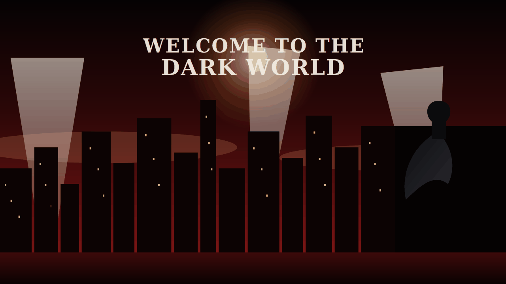

# PRAVEEN B

### CYBER SECURITY ENGINEERING | NETWORK SECURITY | VAPT | ETHICAL HACKING

 

---

<table width="100%">
<tr>
<td width="30%" align="center">

</td>

<td width="70%">

# 🛡️ BATCAVE COMMAND CENTER

### 👤 PROFILE

- **NAME:** PRAVEEN B
- **ROLE:** CYBER SECURITY ENGINEERING 

### 🔐 SPECIALIZATION

- VULNERABILITY ASSESSMENT & PENETRATION TESTING (VAPT)
- NETWORK SECURITY & MONITORING
- ETHICAL HACKING
- MALWARE ANALYSIS
- THREAT HUNTING
- DIGITAL FORENSICS
- LINUX ADMINISTRATION
- PYTHON SECURITY AUTOMATION
- PACKET ANALYSIS (WIRESHARK, TCPDUMP)
- SECURITY RESEARCH
- INCIDENT RESPONSE
- AI IN CYBERSECURITY

</td>
</tr>
</table>

